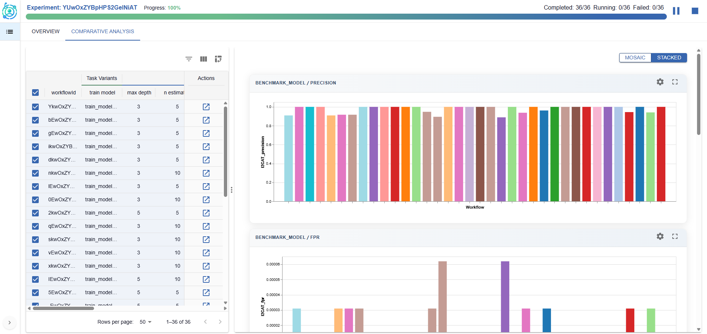

# **ExperimentLens**
### *Exploring, Monitoring, and Explaining complex AI pipelines*

## About ExperimentLens
**ExperimentLens** is a lightweight yet powerful visual dashboard for the interactive exploration, monitoring, and explainability of complex AI pipelines.

Developed within the context of the [ExtremeXP project](https://extremexp.eu/), ExperimentLens empowers researchers, data scientists, and engineers to make sense of experimental results across multiple runs and interconnected tasks.

The tool is centered on **human-in-the-loop experimentation**, enabling users to monitor pipeline lifecycles, inspect results, and gain insights into pipeline behavior and configuration sensitivity.

  
  

    ExperimentLens dashboard: analyzing configuration effects on experiment performance.
  

## Core Features
### Run and Configuration Analysis

- Compare metrics and outputs across multiple experiment runs.
- Analyze the effect of variability points (e.g., hyperparameters, engine configurations).
- Detect patterns, trends, and outliers across different pipeline variants.

### Pipeline Control and Human-in-the-Loop Feedback

- Monitor and steer pipeline executions at runtime, guided by intermediate results and visual feedback.
- Use diagnostic views to adjust configuration choices and re-launch modified pipelines.
- Support interactive refinement by integrating user feedback into the exploration process.

### Artifact and Data Inspection

- Preview input and output datasets, prediction results, and artifacts in rich visual formats.
- Context-aware inspection scoped to the task and pipeline level.

### Integrated Explainability

- Access both local and global post-hoc explanation techniques.
- Visualize results of explainability methods like counterfactual examples, Partial Dependence Plots (PDP), and Accumulated Local Effects (ALE).
- Link pipeline behavior to specific inputs, parameter settings, and structure.

  
  

    Comparative analysis in ExperimentLens: visualizing metric distributions across pipeline variants.
  

## Technical Overview
ExperimentLens is designed for flexibility and extensibility across diverse AI experimentation infrastructures.

- **Experiment tracking integration**: Supports tools like **MLflow** for logging run-level metrics, parameters, and artifacts—enabling visual analysis of experiment outcomes.
- **Workflow orchestration integration**: Connects with **workflow orchestration frameworks** to enable lifecycle control, task-level tracing, and dynamic adjustment of pipelines. Currently, the **ExtremeXP Execution Engine** is supported. Future integration is planned with additional tools such as **Kubeflow**, **Airflow**, and other orchestration platforms.

## Get Involved

We welcome collaborations, feedback, and pilot use cases across domains.

To learn more, contribute, or request a demo:

- **Email**: [stavmars@athenarc.gr](mailto:stavmars@athenarc.gr), [gpapas@athenarc.gr](mailto:gpapas@athenarc.gr)
- **GitHub Repositories**:
  - [Frontend](https://github.com/extremexp-HORIZON/vis-frontend)
  - [Backend API](https://github.com/extremexp-HORIZON/vis-api)
  - [Explainability Module](https://github.com/extremexp-HORIZON/explainability-module)
