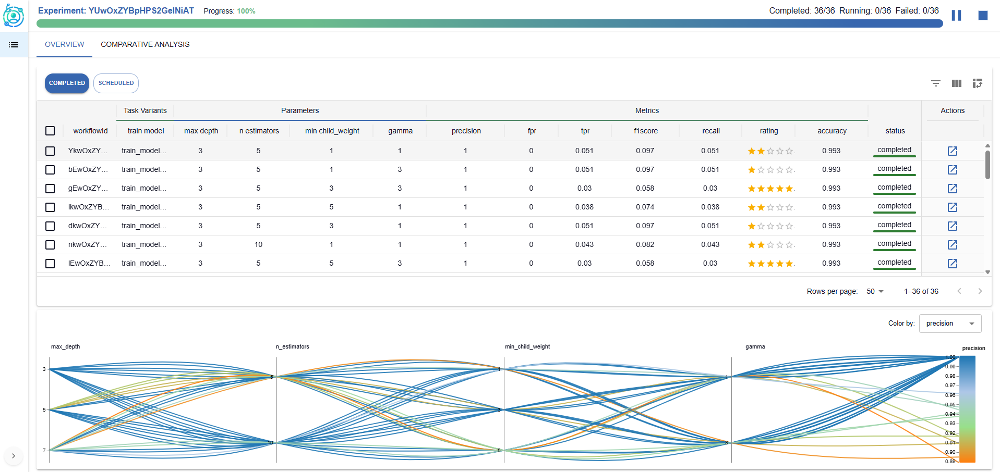

# **ExperimentLens**
### *A visual interface for exploring and explaining machine learning workflows*

## About ExperimentLens

**ExperimentLens** is a lightweight yet powerful visual dashboard for the interactive exploration, analysis, and explainability of machine learning workflows.

Developed within the context of the [ExtremeXP project](https://extremexp.eu/), ExperimentLens empowers researchers, data scientists, and engineers to make sense of experimental results across multiple runs and complex task pipelines.

The tool is centered on **human-in-the-loop experimentation**, enabling users to monitor experiment lifecycles, inspect results, and gain insights into model performance and configuration sensitivity.

  
  

    ExperimentLens dashboard: analyzing configuration effects on experiment performance.
  

## Core Features

### Run and Configuration Analysis

- Compare metrics and outputs across multiple experiment runs.
- Analyze the effect of variability points (e.g., hyperparameters, engine configurations).
- Detect patterns, trends, and outliers across different workflows and task variants.

### Experiment Control and Human-in-the-Loop Feedback

- Monitor and steer experiments at runtime, guided by intermediate results and insights.
- Use visual diagnostics to adjust configuration choices and re-launch modified workflows.
- Support interactive experiment refinement by integrating user feedback into the exploration loop.

### Artifact and Data Inspection

- Preview input and output datasets, prediction results, and artifacts in rich visual formats.
- Supports structured data (CSV, JSON), image outputs, and directory-based artifacts.
- Context-aware inspection scoped to the task and workflow level.

### Integrated Explainability

- Access both local and global post-hoc explanation techniques.
- Visualize counterfactual examples, Partial Dependence Plots (PDP), and Accumulated Local Effects (ALE).
- Link model behavior to specific inputs, parameter settings, and pipeline structure.

## Technical Overview

ExperimentLens is designed for flexibility and extensibility across diverse ML experimentation infrastructures.

- **Experiment tracking integration**: Supports tools like **MLflow** for logging run-level metrics, parameters, and artifacts—enabling visual analysis of experimental outcomes.
- **Workflow orchestration integration**: Connects with **workflow orchestration frameworks** to enable lifecycle control, task-level tracing, and dynamic adjustment of workflows. Currently, the **ExtremeXP Execution Engine** is supported. Future integration is planned with additional tools such as **Kubeflow**, **Airflow**, and other pipeline orchestration platforms.

## Get Involved

We welcome collaborations, feedback, and pilot use cases across domains.

To learn more, contribute, or request a demo:

- **Email**: [stavmars@athenarc.gr](mailto:stavmars@athenarc.gr), [gpapas@athenarc.gr](mailto:gpapas@athenarc.gr)
- **GitHub Repositories**:
  - [Frontend](https://github.com/extremexp-HORIZON/vis-frontend)
  - [Backend API](https://github.com/extremexp-HORIZON/vis-api)
  - [Explainability Module](https://github.com/extremexp-HORIZON/explainability-module)
